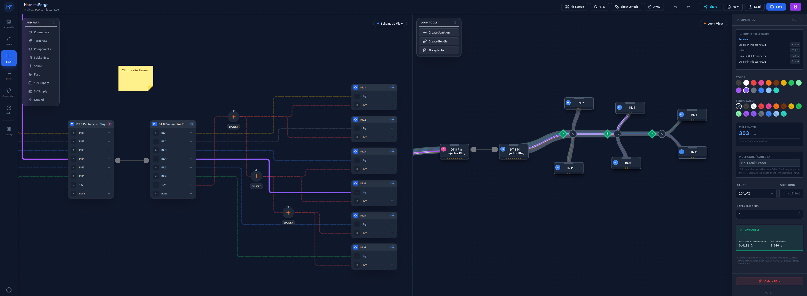
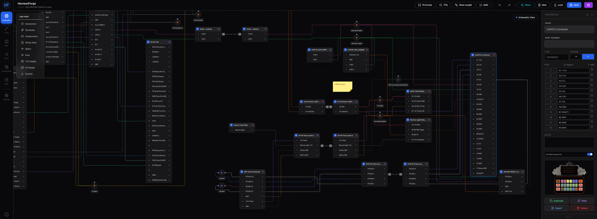
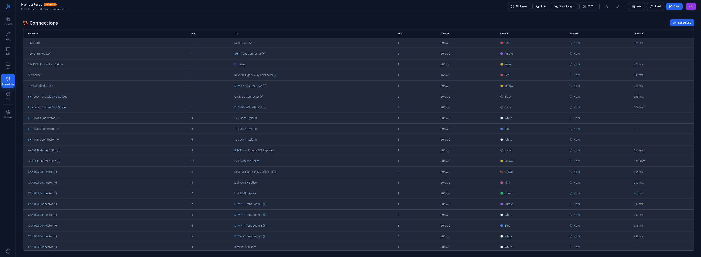
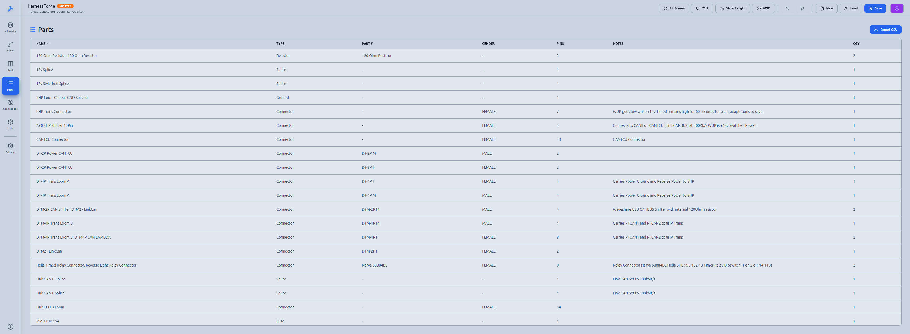

# HarnessForge - Wire Harness Design Tool

Version: 3.2.x 

[harnessforge.app](https://harnessforge.app)

HarnessForge is a React JSX based Wire Harness Design Tool. It aims to simplify and speed up creation of logical schematic diagrams and physical loom layouts. It was designed with automotive, motorsport and DIY wiring projects in mind and allows users to design and map wiring quickly between connectors and typical automotive components, create virtual loom bundles to represent the physical harness and can automatically calculate wire lengths and provide a cut list.
It uses TailwindCSSv3 and the lucide-react icon set.



# Example Project File Share Links
* [Simple Injector Loom](https://harnessforge.app/?share_id=f76134237b01)
* [Demo Aux Loom](https://harnessforge.app/?share_id=bc37041db526)
# Example Project Files Github Links
* [Simple Injector Loom](ExampleFiles/Simple%20Injector%20Loom.json)
* [Demo Aux Loom](ExampleFiles/Demo%20Aux%20Loom.json)
# Example Connectors (with diagrams)
* [BMW 8HP Transmission](Connectors/BMW/8HP%20Trans%20Connector_Template.json)
* [BMW 8HP 10Pin Shifter](Connectors/BMW/A90%208HP%20Shifter%2010Pin_Template.json)
* [Cantcu](Connectors/Cantcu/CANTCU%20Connector_Template.json)
* [Deutsch](Connectors/Deutsch/DT4.json)
* [Link G4X XtremeX A](Connectors/Link/Link%20G4X%20XtremeX%20A%20Connector-img_Template.json)
* [Link G4X XtremeX B](Connectors/Link/Link%20G4X%20XtremeX%20A%20Connector-img_Template.json)

# Key Features

* Dual-View Design: seamless toggling between Schematic (logical) and Loom (physical) views and the option to Split View (both).

* Schematic:
    * Logical connections between components (pin to pin).
    * Auto wire routing for schematic diagrams.
    * Wires calculate the shortest path with auto collision avoidance. Wires to/from the same pin will stack.
    * Wire lengths are calculated based on the physical loom layout and bundle lengths.
    * Wire gauge and colour can be set (AWG).
    * Connectors can have notes and diagrams added.
* Loom:
    * Virtual representation of the physical loom (connector to connector)
    * Wires take shortest/best path through loom between connectors.
    * Define bundle lengths and physical routing.
    * Junctions: Place junctions to split your loom into multiple paths.
    * Splices: Splices defined in schematic view can be snapped to bundles and auto-calculate wire lengths before and after the splice.
    * Cut List Calculation: Automatically calculates wire lengths including a configurable service loop.

* Sticky Notes: Add notes with additional context/info to your diagram.
* Component Management: Support for Connectors (DT/Custom), Splices, Diodes, Resistors, Fuses, and Relays.
* Wire Circuit Highlighting: Show all connected pins on the circuit via a Breadth-First Search (BFS).
* Data Export/Import:
    * JSON Project saving/loading.
    * CSV Export for Parts List (Bill of Materials) and Connections/Wire Cut Lists.
    * Connector Import/Export
    * Connector Pin definitions can be imported from CSV. (See help file for formatting)
    * Connector Diagram Import (1MB Max Size) for visual representation of connectors.
* Print-ready diagram generation (white background/adjusted white wire colours).
* Diagram Sharing (Online harnessforge.app version only) - create share links to send your diagrams to others.


# Installation & Setup
For Local installations Electron release builds are provided for Linux (Deb/Appimage/tar.gz) and Windows (exe) it is also published online via Vercel at [harnessforge.app](https://harnessforge.app).

Linux (deb)
Download latest version from releases. 
In Terminal:
```
sudo dpkg -i harness-forge_3.x.x_amd64.deb
```

Linux (AppImage)
Download Latest Version from releases.
In Terminal set executable permission (+x):
```
chmod +x HarnessForge-3.x.x.AppImage
```
Then run the AppImage.

Linux (tar.gz)
Download latest version from releases. 
In Terminal:
```
tar -xvf harness-forge-3.x.x.tar.gz
cd harness-forge-3.x.x
./harness-forge
```
Alternatively browse to the folder in your filemanager of choice and double click harness-forge.

Note: Some distro's throw errors about sandbox helper binary - this is distro and Electron/chrome-sandbox specific and not this app so you're on your own there. Standard cause is AppArmor in Ubuntu which in certain configurations requires an AppArmor profile to be added. Executing it from the filemanager generally works also.

Windows (exe)
Download latest version from releases, Double Click Installer exe to install.

# Documentation
The in app "Help" view on the side bar is typically the most up to date and complete documentation with screenshots and examples.

# User Guide
## The Interface:
The application is divided into six main views, accessible via the left sidebar:

*    Schematic: The logical drawing board. Place components and draw wires pin-to-pin.
*    Loom: The physical assembly board. Define how wires are bundled together and routed through the vehicle/chassis.
*    Split: View Schematic and Loom side-by-side.
*    Parts: A tabular view of all components (Bill of Materials).
*    Connections: A tabular view of all wires (Cut List).
*    Settings: A List of settings for the project such as: Grid Size, Scale, Service Loop Allowance, Theme (Classic, Light, Dark)

## Working in Schematic View
This is where you define what connects to what.

* Adding Components:
* In the "Add Part" menu (top-left).
* Select a component (Connector, Splice, Fuse, etc.).
* For Connectors, you can choose preset Deutsch (DT) common pin counts or define a custom pin count. If you have a connector saved as a template you can click Import Connector also.

* Wiring:
    * Click a component to see its pins.
    * Click the + (Plus) icon on a source pin.
    * Click in a blank area on the destination pin. (anywhere but it's plus icon)
    * A wire line will auto-route between them.
**Note: Wires have a source and a destination Pin ID, keep this in mind when building your schematic for how you want the connections list to look.**
* Properties: Click any component or wire to open the Properties Panel on the right to change names, gauges, colors, add notes or import a diagram for the connector. This will also show you the calculated wire length, gauge, and will allow you to set an expected amperage load for the wire to calculate max amperage over distance for the specified wire gauge.
* Wire Highlighting: Click a wire and it will highlight showing its path through the schematic. If you use Split view it will also show its path through the harness.
* Wire Lengths: Requires placing connectors and any junctions in loom view, creating bundles between them then snapping any splices (orange diamonds) in their physical location on the loom bundle.

## Working in Loom View
This is where you define how the wires are physically routed.
* Positioning: Components added in Schematic view appear here. Drag them to represent their physical location.
* Junctions: Click "Create Junction" to add anchor points (grey dots) for creating junction points in the loom.
* Bundling (Creating the Harness):
    * Click "Create New Bundle" (Link icon).
    * Click a source component or junction (Start point).
    * Click a destination component or junction (End point).
    * A "bundle" path is created.
**Note: Bundles have a source and a destination, when you change the length of a bundle it will push/pull the destination side away from the source side.**
* Auto-Routing: Wires created in the Schematic view automatically flow through these bundles using the shortest path algorithm.
* Splices: Drag a Splice node onto a Bundle. It will snap to the bundle, the location of these is critical as it will calculate the wire length either side of the splice.
* Bundle Length: Click a bundle to set its length in the properties field then press enter. Or just enable the Show Length toggle and drag it to the desired length.

## Wire Lengths & Calculations
The tool automatically calculates the wire length required to build the harness.
* Calculation Logic: Sum of Bundle Lengths + Service Loop (eg: 50mm).
* Visualizing Lengths: Toggle the Ruler Icon in the top bar to see physical lengths of bundles and wires on the canvas.
* Manual Adjustments: Click a Bundle to manually type in its physical length (mm) in the properties panel. This allows you to match the design to real-world measurements.
* Scaling: Set the pixels per mm in the Settings menu (default: 1), this allows scaling for physically larger or smaller looms. You may want to increase this value when working on smaller harnesses or decrease to 0.5 for larger harnesses.

**Note: Changing the scaling does not adjust the physical location of parts so you will need to manually adjust these.**

## FAQ
* Q: I have finished my schematic view now there are a bunch of parts connected by dashed lines on my loom page, what do I do now?
    * A: The dashed wires on the loom page represent the logical connections created by the schematic, in order to physicalise these you need to connect them with bundles. Bundles can either connect two components together or a component to a junction point. Use junctions as an exit point for you to split things out of the loom on a different path. The example files listed above demonstrate this.
* Q: I have run a wire with a splice on the schematics page but I am seeing "Not routed in Loom"
    * A: The Splice (diamond) objects need to be snapped into a bundle on the loom before wire lengths can be calculated with splices.
    * A Cont: Resistors and diode's are intentionally excluded on the loom page and as such any wires running to these will always show "Not routed in Loom" and no lengths will be calculated.
* Q: I want to represent both sides of a connector of an associated harness but now my wire lengths are wrong.
    * A: In the **Schematic View** first make sure there are wires mapped to the appropriate pins (eg Pin 1 Male to Pin 1 Female, Pin 2 Male to Pin 2 Female etc.), once connected drag the connectors until they are physically next to eachother, if connectors are butted up next to eachother this will hide the connections underneath if you prefer.
    * A Cont: In the **Loom View** do not create a bundle joining them as this will effect wire lengths, there will be a dashed line (Air Wire) connecting them logically, just drag them side by side to hide this underneath if you prefer. Wire pathing will continue on the other side of the connector to it's destination and wire cut lengths will remain correct.

## Release Notes
* See releases for notes per version.

## Known Issues
* Windows Build Specific: Printing Schematic or Loom to PDF occasionally shows some 1 pixel tearing. Seems to be something specific to the Windows Electron build only.

## Screenshots
Schematic View (Dark Theme)


Connections View (Classic Theme)


Parts View (Light Theme)

